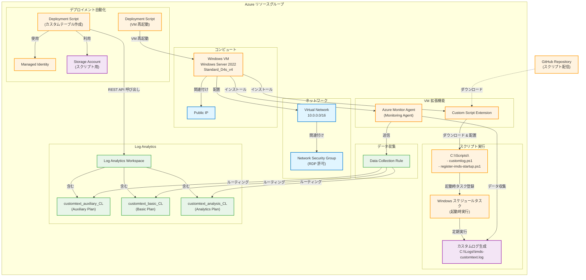
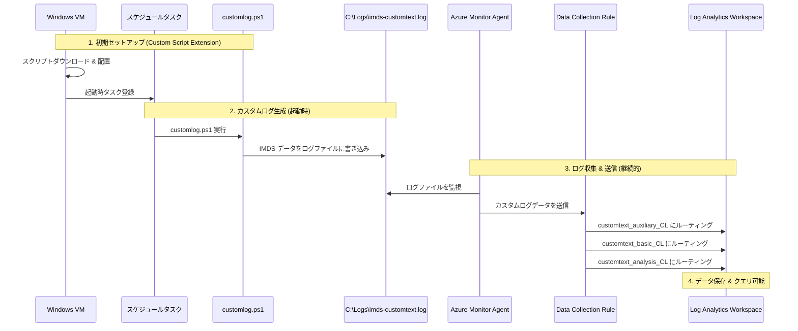

# Log Analytics Table Plan

このフォルダには、Log Analytics の Table Plan の検証用 Bicep ファイルが含まれています。

## 概要

このテンプレートは、以下のリソースをデプロイします：

## 構成図



## リソース詳細

1. **Virtual Network (仮想ネットワーク)**
   - サブネット付きの VNet を作成

2. **Network Security Group (ネットワークセキュリティグループ)**
   - RDP アクセスを許可するルール付き

3. **Windows VM (仮想マシン)**
   - Windows Server 2022 Datacenter Azure Edition
   - パブリック IP アドレス付き
   - Monitoring Agent / Custom Script Extension を利用

4. **Log Analytics Workspace (Log Analytics ワークスペース)**
   - カスタムテーブルを格納するためのワークスペース

5. **Deployment Script (デプロイメントスクリプト)**
   - Log Analytics にカスタムテーブルを 3 つ作成
     - `customtext_auxiliary_CL`（Auxiliary プラン）
     - `customtext_basic_CL`（Basic プラン）
     - `customtext_analysis_CL`（Analytics プラン）
   - 3 テーブルとも共通スキーマ (TimeGenerated, RawData)
   - マネージド ID を使用して認証

6. **Data Collection Rules (データ収集ルール)**
   - カスタムログファイル `C:\\Logs\\imds-customtext.log` からのテキストデータを収集
   - 収集ストリーム `Custom-Text-customtext_analysis_CL` を 3 テーブル（Auxiliary / Basic / Analytics）にルーティング
   - Log Analytics Workspace への AMA ベースのデータ送信
   - VM 拡張（Monitoring Agent）との関連付け

7. **Custom Script Extension**
   - GitHub から `customlog.ps1` と `register-imds-startup.ps1` をダウンロード
   - `C:\\Scripts` 配下にスクリプトを配置
   - `register-imds-startup.ps1` を実行して、起動時タスクとして `customlog.ps1` を登録
   - `customlog.ps1` が `C:\\Logs\\imds-customtext.log` を生成・更新する想定

## 使用方法

### 前提条件

- Azure サブスクリプション
- Azure CLI または Azure PowerShell
- Bicep CLI

### デプロイ

```bash
# リソースグループの作成
az group create --name rg-logaplan --location japaneast

# パラメータファイル (main.bicepparam) を編集してパスワードを設定
# adminPassword の値を安全なパスワードに更新

# Bicep ファイルのデプロイ (bicepparam を使用)
az deployment group create \
   --resource-group rg-logaplan \
   --template-file main.bicep \
   --parameters main.bicepparam
```

### パラメータ

| パラメータ名 | 型 | デフォルト値 | 説明 |
|------------|------|------------|------|
| location | string | リソースグループの場所 | リソースのデプロイ場所 |
| prefix | string | 'logaplan' | リソース名のプレフィックス |
| vnetAddress | string | '10.0.0.0/16' | 仮想ネットワークのアドレス空間 |
| adminUsername | string | 'AzureAdmin' | VM の管理者ユーザー名 |
| adminPassword | securestring | なし (必須) | VM の管理者パスワード |

## デプロイされるリソース

デプロイ後、以下のリソースが作成されます：

- `{prefix}-nsg`: ネットワークセキュリティグループ
- `{prefix}-vnet`: 仮想ネットワーク
- `{prefix}-law`: Log Analytics ワークスペース
- `{prefix}-vm`: Windows 仮想マシン
- `{prefix}-identity`: マネージド ID
- `{prefix}-create-table-script`: カスタムテーブル作成用デプロイメントスクリプト
- `${prefix}sa<unique>`: ストレージアカウント（デプロイメントスクリプト用）
- `{prefix}-dcr`: データ収集ルール
- `customtext_auxiliary_CL`: Auxiliary プランのカスタムテーブル (Log Analytics 内)
- `customtext_basic_CL`: Basic プランのカスタムテーブル (Log Analytics 内)
- `customtext_analysis_CL`: Analytics プランのカスタムテーブル (Log Analytics 内)
- `{prefix}-vm-restart-script`: VM 再起動用デプロイメントスクリプト

## 出力

デプロイ完了後、以下の情報が出力されます：

- `virtualNetworkId`: 仮想ネットワークのリソース ID
- `vmName`: VM の名前
- `logAnalyticsWorkspaceId`: Log Analytics ワークスペースのリソース ID
- `logAnalyticsWorkspaceName`: Log Analytics ワークスペースの名前
- `dataCollectionRuleName`: データ収集ルールの名前
- `storageAccountName`: ストレージアカウントの名前

## Table Plan について

このテンプレートでは、以下の 3 つのカスタムテーブルを作成します：

- `customtext_auxiliary_CL`（Auxiliary プラン）
- `customtext_basic_CL`（Basic プラン）
- `customtext_analysis_CL`（Analytics プラン）

3 テーブルとも、共通のシンプルなスキーマを持ちます：

- `TimeGenerated`: ログのタイムスタンプ (DateTime)
- `RawData`: ログの生テキスト (string)

Data Collection Rule では、カスタムログファイル `C:\\Logs\\imds-customtext.log` を読み取り、
`Custom-Text-customtext_analysis_CL` ストリームとして取り込み、KQL 変換なしで
そのまま 3 つのテーブル（Auxiliary / Basic / Analytics）にルーティングします。

各プランの特徴（コストや保持期間、クエリ機能の違い）を比較検証するための構成になっています。

## データフロー



## 注意事項

- **デプロイメントスクリプト**: マネージド ID を使用して Azure REST API を呼び出します
- **セキュリティ**: VM には RDP アクセスが可能ですが、本番環境では適切なセキュリティ対策を実施してください
- **カスタマイズ**: カスタムテーブルのスキーマは、要件に応じてカスタマイズできます
- **Data Collection Endpoint**: 最新の Data Collection Rules では、カスタムログ収集時に Data Collection Endpoint は不要です（このテンプレートでは使用していません）
- **VM 再起動**: デプロイ後、VM が自動的に再起動され、スケジュールタスクが有効になります
- **ログ生成**: VM 起動時に `customlog.ps1` が実行され、`C:\Logs\imds-customtext.log` にログが生成されます

## トラブルシューティング

### カスタムテーブルにデータが表示されない場合

1. **VM の再起動を確認**
   ```bash
   az vm show -g rg-logaplan -n logaplan-vm --query "powerState"
   ```

2. **ログファイルの生成を確認**
   - VM に RDP 接続
   - `C:\Logs\imds-customtext.log` が存在するか確認

3. **Azure Monitor Agent の状態を確認**
   ```bash
   az vm extension show -g rg-logaplan --vm-name logaplan-vm -n AzureMonitorWindowsAgent
   ```

4. **Data Collection Rule の関連付けを確認**
   ```bash
   az monitor data-collection rule association list --resource /subscriptions/<subscription-id>/resourceGroups/rg-logaplan/providers/Microsoft.Compute/virtualMachines/logaplan-vm
   ```

5. **Log Analytics でクエリを実行**
   ```kql
   customtext_analysis_CL
   | take 10
   ```

### デプロイメントスクリプトが失敗する場合

- Azure ポータルで Deployment Script のログを確認
- マネージド ID に適切な権限が付与されているか確認

## クリーンアップ

リソースを削除するには：

```bash
az group delete --name rg-logaplan --yes --no-wait
```
