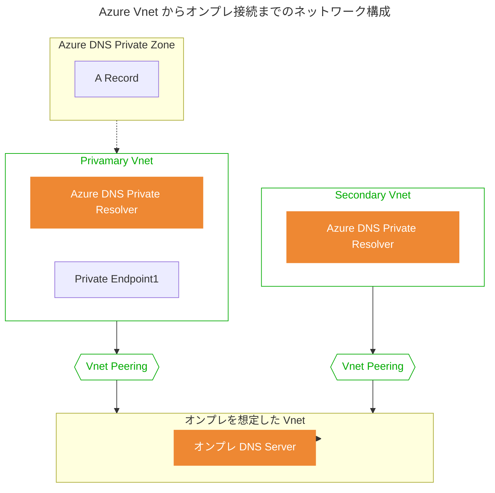

```mermaid
---
title: Azure Vnet からオンプレ接続までのネットワーク構成
---
graph TB;

%%グループとサービス
subgraph Vnet1[Privamary Vnet]
    DNS1["Azure DNS Private Resolver"]
    PE1["Private Endpoint1"]
end
EX1{{"Vnet Peering"}}
subgraph zone1["Azure DNS Private Zone"]
    A1["A Record"]
end

subgraph Vnet2[Secondary Vnet]
    DNS2["Azure DNS Private Resolver"]
end
EX2{{"Vnet Peering"}}

subgraph OnPrem[オンプレを想定した Vnet]
    DNSC["オンプレ DNS Server"]
end

%%サービス同士の関係
Vnet1 --> EX1
Vnet2 --> EX2
EX1 --> OnPrem
EX2 --> OnPrem
DNSC --> OnPrem

zone1 -.-> Vnet1

%%サブグラフのスタイル
classDef VnetG fill:none,color:#0a0,stroke:#0a0
class Vnet1,Vnet2,EX1,EX2 VnetG

classDef SCP fill:#e83,color:#fff,stroke:none
class DNS1,DNS2,DNSC SCP
```