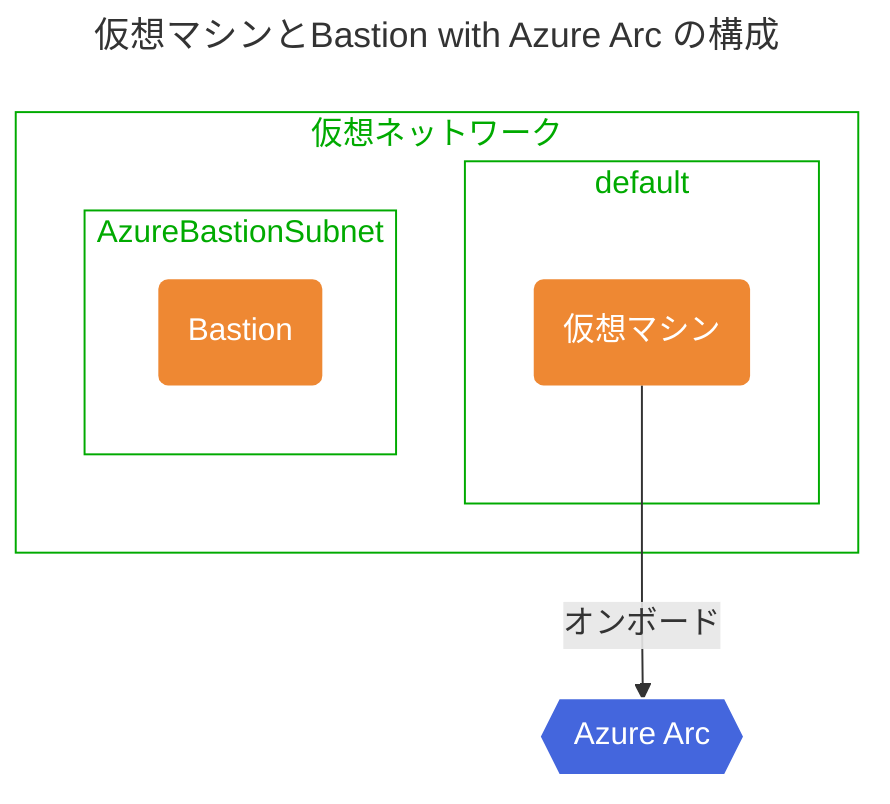

仮想ネットワークにサブネットが2つ。1つは仮想マシン。もう1つは Bastion 用。
仮想マシンには拡張機能スクリプトが実行され、Azure Arc としてオンボードされる。

```mermaid
---
title: 仮想マシンとBastion with Azure Arc の構成 
---
graph TD
subgraph Vnet["仮想ネットワーク"]
    subgraph subnet1["default"]
        VM("仮想マシン")
    end
    subgraph subnet2["AzureBastionSubnet"]
        Bastion("Bastion")
    end
end

VM -- "オンボード" --> Arc{{"Azure Arc"}}

classDef subnetG fill:none,color:#0a0,stroke:#0a0
class Vnet,subnet1,subnet2 subnetG

classDef comp fill:#e83,color:#fff,stroke:none
class VM,Bastion comp

classDef PaaSG fill:#46d,color:#fff,stroke:#fff
class Arc PaaSG
```