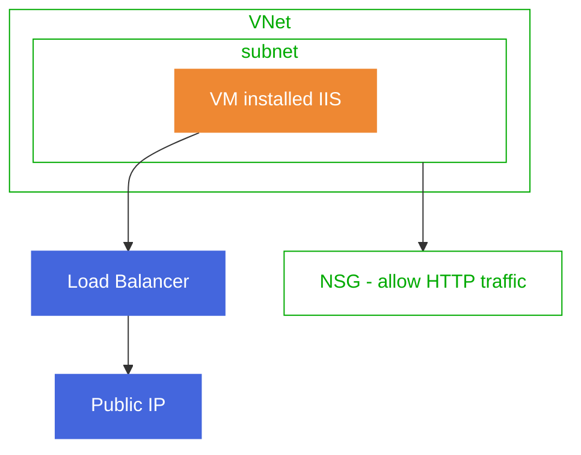

Azureの構成図をMermaidを使って表現すると以下のようになります：

```mermaid
graph TB;

%%サービス定義
subgraph VNet
    subgraph subnet
        VM1["VM installed IIS"]
    end
end

Ip1["Public IP"]

LB1["Load Balancer"]

NSG1["NSG - allow HTTP traffic"]


%%サービス同士の関係
subnet --> NSG1
VM1 --> LB1
LB1 --> Ip1

%%サブグラフのスタイル
classDef VnetG fill:none,color:#0a0,stroke:#0a0
class VNet,NSG1,subnet VnetG

classDef VMG fill:#e83,color:#fff,stroke:none
class VM1 VMG

classDef PaaSG fill:#46d,color:#fff,stroke:#46d
class LB1,Ip1 PaaSG

%%サブグラフのスタイル
classDef VnetG fill:none,color:#0a0,stroke:#0a0
class VNet1,NSG1 VnetG

classDef VMG fill:#e83,color:#fff,stroke:none
class VM1 VMG

classDef PaaSG fill:#46d,color:#fff,stroke:#46d
class LB1,Ip1 PaaSG
```