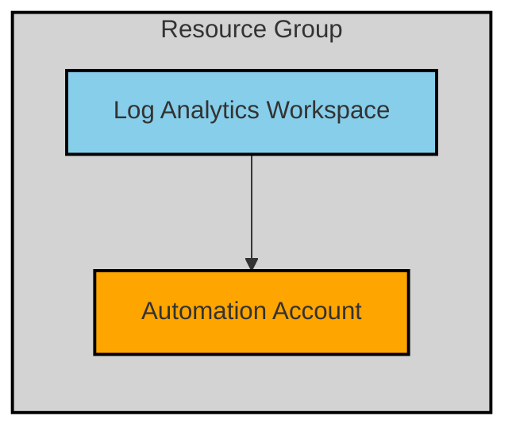
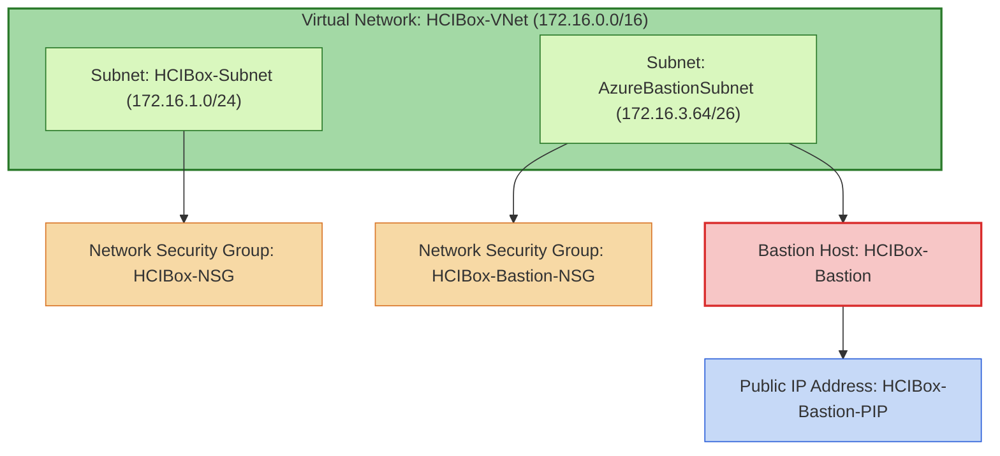

## mgmtArtifacts.bicep

```mermaid
graph TD
  subgraph ResourceGroup["Resource Group"]
    direction TB
    Workspace["Log Analytics Workspace"]
    AutomationAccount["Automation Account"]
  end

  Workspace --> AutomationAccount

  %% スタイル設定
  style Workspace fill:#87CEEB,stroke:#000,stroke-width:2px
  style AutomationAccount fill:#FFA500,stroke:#000,stroke-width:2px
  style ResourceGroup fill:#D3D3D3,stroke:#000,stroke-width:2px
```

## network.bicep

```mermaid
graph TD
  subgraph VNet["Virtual Network: HCIBox-VNet (172.16.0.0/16)"]
    direction TB
    Subnet1["Subnet: HCIBox-Subnet (172.16.1.0/24)"]
    Subnet2["Subnet: AzureBastionSubnet (172.16.3.64/26)"]
  end

  Subnet1 --> NSG1["Network Security Group: HCIBox-NSG"]
  Subnet2 --> NSG2["Network Security Group: HCIBox-Bastion-NSG"]
  Subnet2 --> Bastion["Bastion Host: HCIBox-Bastion"]
  Bastion --> PIP["Public IP Address: HCIBox-Bastion-PIP"]

  %% 色分け
  style VNet fill:#a3d9a5,stroke:#2b7a2b,stroke-width:2px
  style Subnet1 fill:#d9f7be,stroke:#2b7a2b,stroke-width:1px
  style Subnet2 fill:#d9f7be,stroke:#2b7a2b,stroke-width:1px
  style NSG1 fill:#f7d9a5,stroke:#d9772b,stroke-width:1px
  style NSG2 fill:#f7d9a5,stroke:#d9772b,stroke-width:1px
  style Bastion fill:#f7c6c6,stroke:#d92b2b,stroke-width:2px
  style PIP fill:#c6d9f7,stroke:#2b5fd9,stroke-width:1px
```