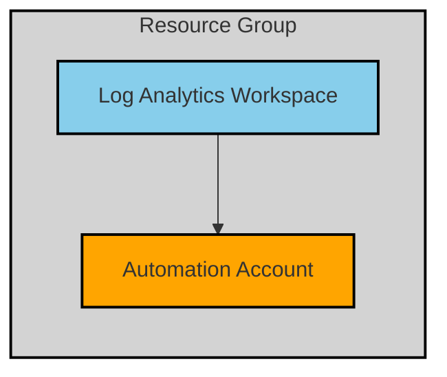
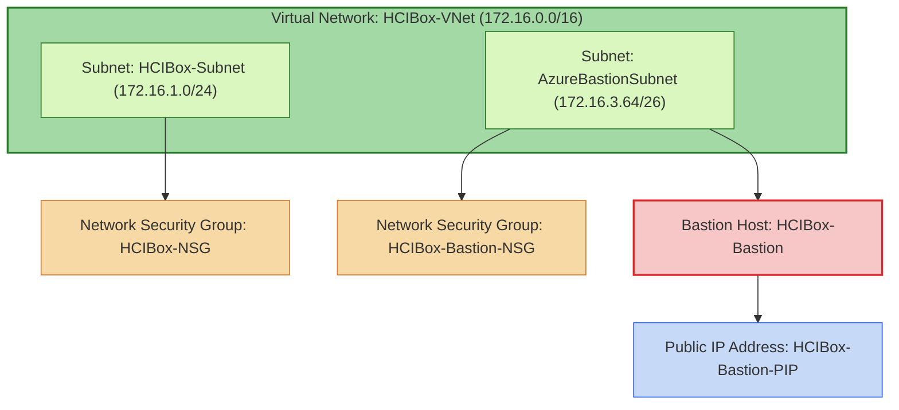
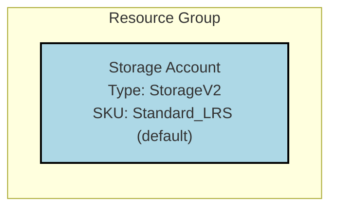
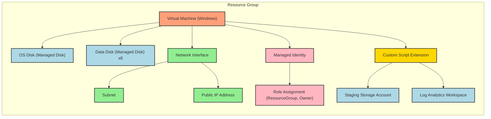

## mgmtArtifacts.bicep

```mermaid
graph TD
  subgraph ResourceGroup["Resource Group"]
    direction TB
    Workspace["Log Analytics Workspace"]
    AutomationAccount["Automation Account"]
  end

  Workspace --> AutomationAccount

  %% スタイル設定
  style Workspace fill:#87CEEB,stroke:#000,stroke-width:2px
  style AutomationAccount fill:#FFA500,stroke:#000,stroke-width:2px
  style ResourceGroup fill:#D3D3D3,stroke:#000,stroke-width:2px
```

## network.bicep

```mermaid
graph TD
  subgraph VNet["Virtual Network: HCIBox-VNet (172.16.0.0/16)"]
    direction TB
    Subnet1["Subnet: HCIBox-Subnet (172.16.1.0/24)"]
    Subnet2["Subnet: AzureBastionSubnet (172.16.3.64/26)"]
  end

  Subnet1 --> NSG1["Network Security Group: HCIBox-NSG"]
  Subnet2 --> NSG2["Network Security Group: HCIBox-Bastion-NSG"]
  Subnet2 --> Bastion["Bastion Host: HCIBox-Bastion"]
  Bastion --> PIP["Public IP Address: HCIBox-Bastion-PIP"]

  %% 色分け
  style VNet fill:#a3d9a5,stroke:#2b7a2b,stroke-width:2px
  style Subnet1 fill:#d9f7be,stroke:#2b7a2b,stroke-width:1px
  style Subnet2 fill:#d9f7be,stroke:#2b7a2b,stroke-width:1px
  style NSG1 fill:#f7d9a5,stroke:#d9772b,stroke-width:1px
  style NSG2 fill:#f7d9a5,stroke:#d9772b,stroke-width:1px
  style Bastion fill:#f7c6c6,stroke:#d92b2b,stroke-width:2px
  style PIP fill:#c6d9f7,stroke:#2b5fd9,stroke-width:1px
```

## storage.bicep

```mermaid
graph TD
    subgraph ResourceGroup["Resource Group"]
        direction TB
        StorageAccount["Storage Account<br>Type: StorageV2<br>SKU: Standard_LRS (default)"]
    end

    %% ストレージアカウントのスタイル設定（青色）
    style StorageAccount fill:#ADD8E6,stroke:#000,stroke-width:2
```

## host.bicep

```mermaid
graph TD
  subgraph ResourceGroup["Resource Group"]
    direction TB
    VM["Virtual Machine (Windows)"]
    OS_Disk["OS Disk (Managed Disk)"]
    Data_Disk["Data Disk (Managed Disk) x8"]
    PublicIP["Public IP Address"]
    NIC["Network Interface"]
    Subnet["Subnet"]
    RoleAssignment["Role Assignment (ResourceGroup, Owner)"]
    ManagedIdentity["Managed Identity"]
    CustomScript["Custom Script Extension"]
    StorageAccount["Staging Storage Account"]
    LogAnalytics["Log Analytics Workspace"]

    VM --> OS_Disk
    VM --> Data_Disk
    VM --> NIC
    NIC --> Subnet
    NIC --> PublicIP
    VM --> ManagedIdentity
    ManagedIdentity --> RoleAssignment
    VM --> CustomScript
    CustomScript --> StorageAccount
    CustomScript --> LogAnalytics
  end

  %% 色分け
  %% コンピュート系 (オレンジ系)
  style VM fill:#FFA07A,stroke:#333,stroke-width:2px
  %% ディスク系 (青系)
  style OS_Disk fill:#ADD8E6,stroke:#333,stroke-width:2px
  style Data_Disk fill:#ADD8E6,stroke:#333,stroke-width:2px 
  %% ネットワーク系 (緑系)
  style PublicIP fill:#90EE90,stroke:#333,stroke-width:2px
  style NIC fill:#90EE90,stroke:#333,stroke-width:2px
  style Subnet fill:#90EE90,stroke:#333,stroke-width:2px
  %% セキュリティ系 (赤系)
  style RoleAssignment fill:#FFB6C1,stroke:#333,stroke-width:2px
  style ManagedIdentity fill:#FFB6C1,stroke:#333,stroke-width:2px
  %% その他 (黄色系)
  style CustomScript fill:#FFD700,stroke:#333,stroke-width:2px
  %% データストレージ系 (青系)
  style StorageAccount fill:#ADD8E6,stroke:#333,stroke-width:2px
  style LogAnalytics fill:#ADD8E6,stroke:#333,stroke-width:2px
```