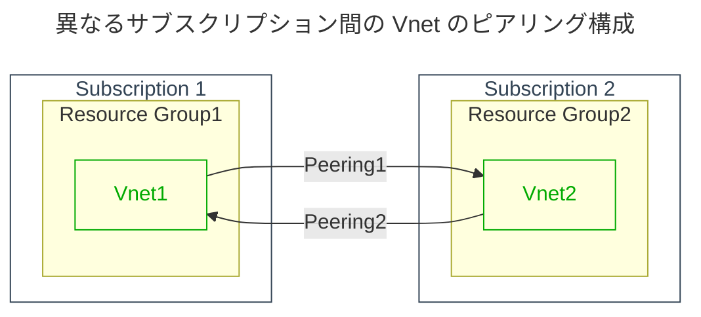

```CLI
az deployment mg create --name demoMGDeployment --location japaneast --management-group-id xxx --template-file main.bicep
```



```mermaid
---
title: 異なるサブスクリプション間の Vnet のピアリング構成
---
graph LR;

%% サブスクリプション、リソースグループ、Vnet
subgraph sub1["Subscription 1"]
    subgraph rg1["Resource Group1"]
        vnet1[Vnet1]
    end
end

subgraph sub2["Subscription 2"]
    subgraph rg2["Resource Group2"]
        vnet2[Vnet2]
    end
end

%% Vnet同士のピアリング関係
vnet1 -- "Peering1" --> vnet2
vnet2 -- "Peering2" --> vnet1

%% サブグラフのスタイル
classDef subG fill:none,color:#345,stroke:#345
class sub1,sub2 subG

classDef VnetG fill:none,color:#0a0,stroke:#0a0
class vnet1,vnet2 VnetG
```