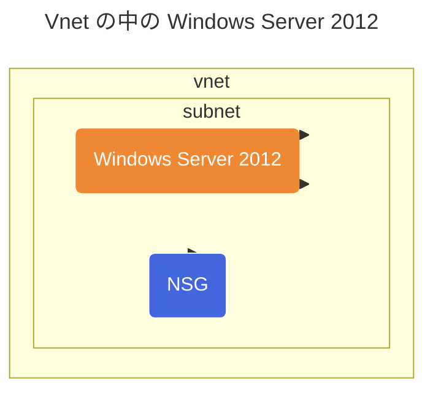

```mermaid
---
title: Vnet の中の Windows Server 2012
---
graph TB
subgraph Vnet[vnet]
    subgraph Subnet[subnet]
        WS1("Windows Server 2012")
        NSG1(NSG)
    end
end

classDef subG fill:none,color:#0a0,stroke:#0a0
class Vnet,Subnet subG
classDef SCP fill:#e83,color:#fff,stroke:none
class WS1 SCP
classDef NSGG fill:#46d,color:#fff,stroke:#fff
class NSG1 NSGG

Vnet --> Subnet
Subnet --> WS1
Subnet --> NSG1
```

made by Azure OpenAI