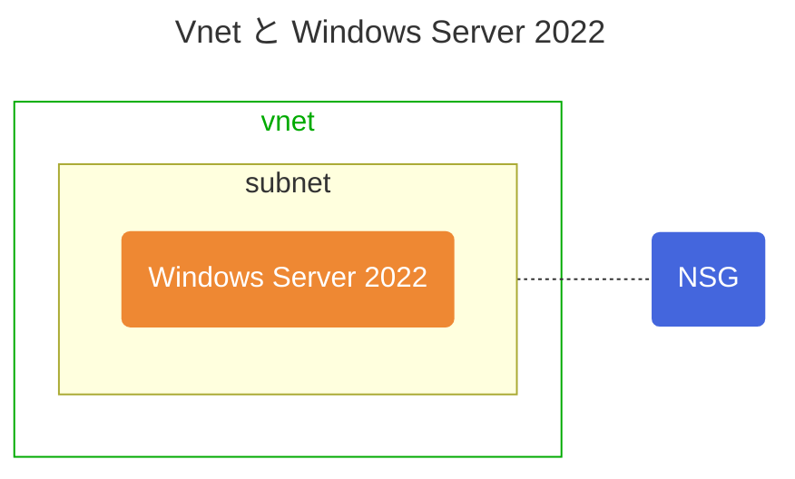

```mermaid
---
title: Vnet と Windows Server 2022
---
graph LR
subgraph Vnet[vnet]
    subgraph Subnet[subnet]
        WS1("Windows Server 2022")
    end
end
NSG1(NSG)

classDef subG fill:none,color:#0a0,stroke:#0a0
class Vnet,Subnet subG
classDef SCP fill:#e83,color:#fff,stroke:none
class WS1 SCP
classDef NSGG fill:#46d,color:#fff,stroke:#fff
class NSG1 NSGG

Subnet -.- NSG1
```

made by Azure OpenAI